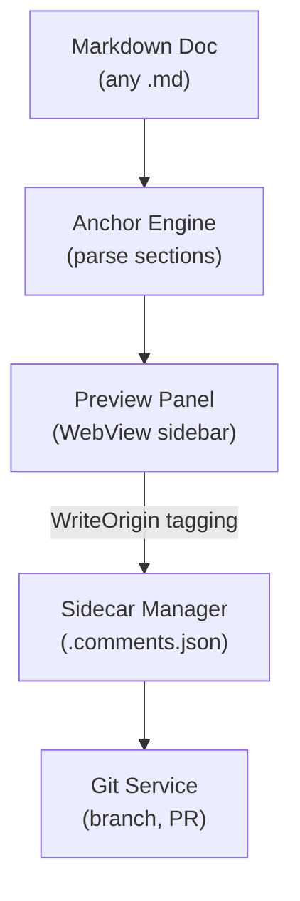

# Markdown Review Extension

## Overview

A VS Code extension that enables inline feedback and comments on markdown files stored in Git. Comments are persisted as sidecar JSON files alongside markdown documents, providing a "docs as code" review workflow with automatic PR creation for GitHub and Azure DevOps.

## Problem Statement

Markdown files checked into Git repositories lack a native review mechanism comparable to code review. Teams resort to:

- Google Docs or Confluence (loses version control benefits)
- PR comments on the entire file (no inline anchoring)
- Manual editing of markdown with inline comments (messy, no threading)

This extension bridges the gap by providing inline, threaded comments anchored to specific sections of markdown documents, with all data stored in Git.

## Goals

1. **Rich preview experience** — Purpose-built WebView sidebar for commenting on markdown sections
2. **Git-native storage** — All comments stored as JSON files in the repository
3. **Stable anchoring** — Comments survive document edits when possible
4. **Automatic PR workflow** — One-click publishing of feedback as pull requests
5. **Multi-provider support** — Works with both GitHub and Azure DevOps

## Non-Goals    

- Real-time collaboration / live sync
- Comment notifications outside VS Code
- Static site rendering of comments
- CI linting for stale comments (future enhancement)

## Architecture

### High-Level Flow



### Component Overview

| Component | Responsibility |
|-----------|----------------|
| `extension.ts` | Activation, command registration, explorer context menu handling |
| `sidecarManager.ts` | Read/write `.comments.json` files, change event bus with `WriteOrigin` tagging |
| `anchorEngine.ts` | Markdown parsing, section detection, hash computation, stale detection |
| `previewPanel.ts` | WebView panel rendering markdown + inline comment sidebar (sole comment UI) |
| `markdownFilesProvider.ts` | Activity Bar sidebar TreeDataProvider, folder picker, comment count badges |
| `decorationProvider.ts` | Gutter icons for comment indicators |
| `gitService.ts` | Branch creation, commits, push operations |
| `githubProvider.ts` | GitHub PR creation via Octokit |
| `adoProvider.ts` | Azure DevOps PR creation via API |
| `authManager.ts` | VS Code built-in authentication providers |

### Preview-Only Architecture

All comment interaction happens through the **Preview Panel** (WebView sidebar). The VS Code Comments API (editor gutter threads) was removed to simplify the UX — users interact with a single, purpose-built comment sidebar.

1. Every `writeSidecar()` call passes a `WriteOrigin` (`'preview'` | `'internal'`)
2. After a successful write, `SidecarManager` fires `onDidChange({ docPath, origin })`
3. The preview panel listens for changes and skips reloads when `origin === 'preview'` to avoid echo loops

```typescript
// In previewPanel — skip own writes:
sidecarManager.onDidChange((e) => {
  if (e.origin === 'preview') return;
  this.update();
});
```

### Resolved Thread Locking

When a thread is resolved:
- **Preview WebView:** JS conditionally hides Reply input, Edit/Delete links, and Delete Thread button based on `thread.status`
- The preview checks `status === 'resolved'` before allowing any mutation and shows a warning if attempted
- Author-gating: edit/delete actions compare `comment.author` against `gitService.getUserName()`

### Comment Reactions

Each comment supports a **thumbs-up reaction** toggle:
- `CommentEntry.reactions` is an optional `string[]` of author names who have reacted
- `sidecarManager.toggleReaction(sidecar, threadId, commentId, author)` adds or removes the author
- The preview sidebar renders a 👍 button with a count badge next to each comment
- Clicking toggles the current user's reaction on/off

### Statistics Chart

The preview sidebar includes a **statistics bar chart** at the bottom showing:
- **Open** threads (blue) vs **Resolved** threads (green)
- Rendered as a stacked horizontal bar with counts and a color legend
- Automatically updates whenever threads are added, resolved, or reopened

### Activity Bar Sidebar

The extension adds an **Activity Bar icon** (Markdown Review) that opens a sidebar TreeView displaying all markdown files in the workspace:

- **Folder picker** — A dropdown at the top filters files to a selected folder
- **Comment count badges** — Each file shows the number of comment threads
- **Click to preview** — Clicking a file opens the preview panel
- **Auto-refresh** — File watchers update the tree when `.md` or `.comments.json` files change

```typescript
// TreeDataProvider structure
class MarkdownFilesProvider implements vscode.TreeDataProvider<TreeItem> {
  private selectedFolder: string | undefined;
  
  selectFolder(): Promise<void> {
    // QuickPick showing all folders containing .md files
  }
}
```

### Explorer Context Menu

The "Markdown: Review and Comment" command is available via right-click on `.md` files in the explorer. The `when` clause uses `resourceExtname == .md` (not `resourceLangId`) so it works even for files that haven't been opened yet. When triggered from the explorer, the extension opens the preview panel and automatically closes any editor tab the explorer might have opened, keeping the workspace focused on the preview.

## Data Model

### Sidecar File Schema

Each markdown document `feature.md` gets a companion `feature.comments.json`:

```json
{
  "doc": "feature.md",
  "version": "1.0",
  "comments": [
    {
      "id": "550e8400-e29b-41d4-a716-446655440000",
      "anchor": {
        "sectionSlug": "authentication-flow",
        "contentHash": "a1b2c3d4e5f6g7h8",
        "lineHint": 42
      },
      "status": "open",
      "isDraft": false,
      "thread": [
        {
          "id": "550e8400-e29b-41d4-a716-446655440001",
          "author": "sarah@company.com",
          "body": "This conflicts with the auth service token refresh window.",
          "created": "2024-02-15T10:30:00Z",
          "edited": null,
          "reactions": ["james@company.com"]
        },
        {
          "id": "550e8400-e29b-41d4-a716-446655440002",
          "author": "james@company.com",
          "body": "Good catch. Should we link to the runbook?",
          "created": "2024-02-15T11:00:00Z",
          "edited": null,
          "reactions": []
        }
      ]
    }
  ]
}
```

### Anchor Strategy

Comments are anchored using a **hybrid approach** for stability:

| Anchor Component | Purpose | Stability |
|------------------|---------|-----------|
| `sectionSlug` | Primary key derived from heading text | Survives content edits |
| `contentHash` | SHA256 of first 200 chars of section body | Detects content drift |
| `lineHint` | Line number for fast lookup | May drift, used as hint only |

**Stale Detection Logic:**
- If `sectionSlug` matches but `contentHash` differs → Mark as "stale" (yellow indicator)
- If `sectionSlug` not found → Comment orphaned (still displayed, marked stale)
- If both match → Comment is current (blue indicator)

### Thread Status

| Status | Meaning | Visual |
|--------|---------|--------|
| `open` | Active discussion | Blue bubble |
| `resolved` | Marked complete | Green checkmark |
| `stale` | Content has drifted | Yellow warning |

## Commands

| Command ID | Title | Trigger |
|-----------|-------|--------|
| `markdownThreads.publishDrafts` | Publish Pending Comments as PR | Status bar, command palette |
| `markdownThreads.openPreview` | Markdown: Review and Comment | Explorer context menu (right-click `.md` file), sidebar click |
| `markdownThreads.refreshFiles` | Refresh markdown files list | Sidebar title bar button |
| `markdownThreads.selectFolder` | Select folder to filter | Sidebar title bar folder icon |

### Menu Layout

| Menu Location | Items |
|--------------|-------|
| `explorer/context` | "Markdown: Review and Comment" (when `resourceExtname == .md`) |

## User Workflows

### Adding a Comment

1. User right-clicks any `.md` file in the explorer → **"Markdown: Review and Comment"**
2. The Preview Panel opens beside the editor, rendering the markdown with a comment sidebar
3. User clicks a section heading's "Add Comment" button in the sidebar
4. User types feedback and submits
5. Extension writes to sidecar JSON as a **draft**
6. The sidebar stats chart updates with open/resolved counts

> **Note:** The extension automatically closes any editor tab the explorer opens when launching the preview, keeping the workspace tidy.

### Reacting to a Comment

1. User clicks the 👍 button on any comment in the sidebar
2. The reaction toggles on/off (add or remove the user's name)
3. The reaction count updates inline next to the button

###  Publishing Comments

1. User clicks status bar or runs "Publish Pending Comments as PR"
2. Extension creates a new branch: `doc-comment/feature-sarah-2024-02-15`
3. Commits the sidecar file with message: "Add design feedback for feature.md"
4. Pushes branch and creates PR via GitHub/Azure DevOps API
5. Opens browser to the new PR (if `autoOpenPR` is enabled)

### Receiving Comments

1. Teammate merges the PR containing comments
2. User pulls latest changes
3. File watcher detects sidecar file change
4. Comments appear in the preview sidebar when the file is opened

## VS Code APIs Used

| API | Usage |
|-----|-------|
| `vscode.window.createWebviewPanel` | Preview panel with inline comments (sole comment UI) |
| `vscode.authentication.getSession` | GitHub/Microsoft OAuth |
| `vscode.FileSystemWatcher` | React to sidecar changes |
| `vscode.workspace.onDidSaveTextDocument` | Re-render preview on save (not keystroke) |
| `vscode.window.onDidChangeActiveTextEditor` | Follow active markdown file (filters virtual docs) |
| `vscode.window.tabGroups` | Close explorer-opened editor tab after launching preview |

## Configuration

| Setting | Type | Default | Description |
|---------|------|---------|-------------|
| ~~`markdownThreads.docPaths`~~ | `string[]` | `["docs/", "design/"]` | **Deprecated.** Previously restricted comments to specific folders. Comments now work on any `.md` file. |
| `markdownThreads.autoOpenPR` | `boolean` | `true` | Open browser after PR creation |
| `markdownThreads.branchPrefix` | `string` | `"doc-comment"` | Prefix for comment branches |
| `markdownThreads.defaultProvider` | `string` | `"auto"` | Git provider (`auto`, `github`, `azuredevops`) |

## Security Considerations

### Authentication

- Uses VS Code's built-in OAuth providers (no PAT storage in settings)
- GitHub: `github` provider with `repo`, `read:user` scopes
- Azure DevOps: `microsoft` provider with Azure DevOps scope

### Data Sensitivity

- Comments are stored in plain JSON in the repository
- Author emails are taken from git config
- No encryption at rest (rely on repository access controls)

## Testing Strategy

### Framework

- **Mocha** with Node `assert` (tdd UI: `suite()` / `test()`)
- Test runner: `@vscode/test-electron`
- Test files: `src/test/suite/*.test.ts` (auto-discovered by glob)
- Run: `npm run test` (compiles first via `pretest`)

### Unit Tests (88 tests)

| Test File | Tests | Coverage |
|-----------|-------|----------|
| `hash.test.ts` | 6 | Slug generation, content hashing, edge cases, truncation |
| `markdown.test.ts` | 10 | Section parsing, anchor matching, drift detection, code fences, `findSectionByLine` |
| `sidecarManager.test.ts` | 39 | CRUD operations, round-trip I/O, `deleteCommentById`, `editComment`, `updateThreadStatus`, `WriteOrigin` propagation, schema validation |
| `anchorEngine.test.ts` | 16 | Anchor creation, stale detection, section lookup, cache clearing |
| `authManager.test.ts` | 14 | Provider detection (GitHub, ADO, visualstudio.com), URL parsing, edge cases |

### Manual Testing

- F5 launch in Extension Development Host
- Test with any markdown file in the workspace

## Dependencies

| Package | Version | Purpose |
|---------|---------|---------|
| `markdown-it` | ^14.0.0 | Markdown parsing |
| `@octokit/rest` | ^20.0.2 | GitHub API |
| `azure-devops-node-api` | ^12.5.0 | Azure DevOps API |
| `simple-git` | ^3.21.0 | Git operations |
| `uuid` | ^9.0.1 | Comment ID generation |

## Key Design Decisions

### Any Markdown File Support

Originally, commenting was restricted to files under configured folder paths (`docPaths`). This was changed to support **any** `.md` file in the workspace (GitHub Issue #2). The `docPaths` config is deprecated — `isMarkdownFile()` simply checks `document.languageId === 'markdown'` and excludes VS Code's virtual `commentinput-*` documents.

### Preview-Only Comment UI

The extension initially used both the VS Code Comments API (editor gutter threads) and a WebView preview sidebar. This dual-UI approach was removed in favor of **preview-only** commenting. All comment CRUD (create, reply, edit, delete, resolve, reopen) happens exclusively in the WebView sidebar. This simplifies the architecture by:
- Eliminating bidirectional sync complexity between editor and preview
- Removing the `WeakMap<CommentThread, string>` thread identity mapping
- Reducing the command surface from 12 to 2 commands
- Providing a richer, custom-styled UI (reactions, statistics chart)

### Preview Stability

The preview panel avoids re-rendering on every keystroke by using `onDidSaveTextDocument` instead of `onDidChangeTextDocument`. It also:
- Uses `preserveFocus: true` when revealing to avoid stealing focus
- Checks `panel.visible` before scheduling updates
- Filters out VS Code's virtual `commentinput-*.md` documents in `onDidChangeActiveTextEditor`

### Delete by ID

Comment deletion uses `sidecarManager.deleteCommentById()` (not index-based) for concurrency safety when multiple mutation sources are active.

## Future Enhancements

1. **CI Integration** — Lint for stale/unresolved comments older than N days
2. **Static Site Renderer** — View comments in GitHub Pages / Docusaurus
3. **Notifications** — VS Code notification when new comments are merged
4. **Paragraph-level Anchoring** — Comments on specific paragraphs within sections (currently section-level)
5. **Comment Search & Filter** — Search across all comment threads by keyword or author

## Alternatives Considered

### Git Notes

**Rejected:** Git notes are not pushed by default and have poor tooling support.

### Inline HTML Comments

**Rejected:** Pollutes the markdown source, no threading support.

### External Database

**Rejected:** Violates "docs as code" principle, requires infrastructure.

### GitHub PR Comments

**Rejected:** Only available during PR review, lost after merge.

## References

- [VS Code Comments API](https://code.visualstudio.com/api/references/vscode-api#comments)
- [VS Code Authentication API](https://code.visualstudio.com/api/references/vscode-api#authentication)
- [Octokit REST API](https://octokit.github.io/rest.js)
- [Azure DevOps Node API](https://github.com/microsoft/azure-devops-node-api)
