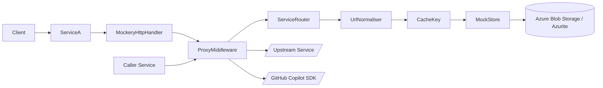
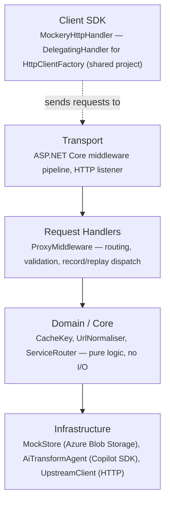
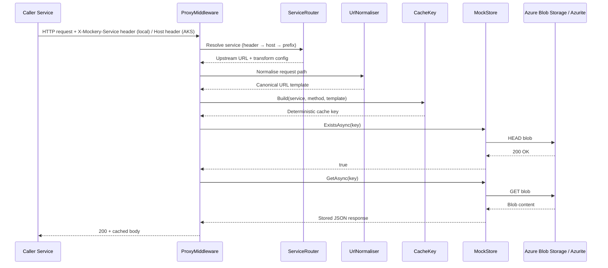
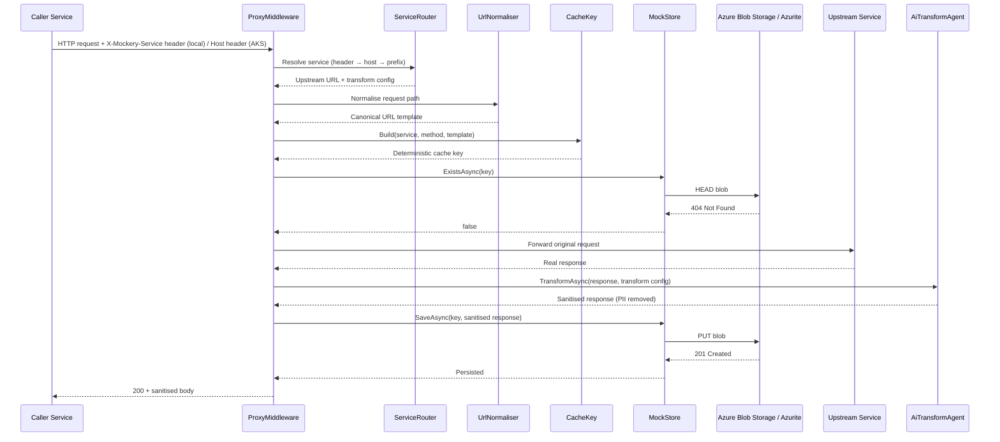
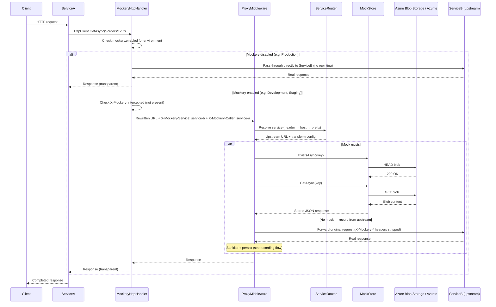
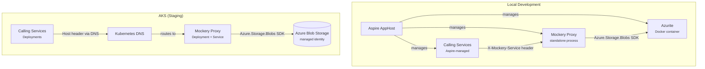

<!-- SPECIT -->

# Architecture — Mockery

> **Version**: 1.3<br>
> **Created**: 2026-04-10<br>
> **Last Updated**: 2026-04-11<br>
> **Owner**: Dave Harding<br>
> **Project**: Mockery<br>
> **Status**: Draft

---

> Mockery is a transparent HTTP proxy for developers working in large multi-service repositories. It intercepts outbound calls to upstream services, captures and sanitises responses to remove personally identifiable information, and replays them on subsequent requests — eliminating cascading dependency startup and manual stub maintenance across local workstations and cloud-hosted development environments.

---

## 1. System Overview

Mockery sits between a service under development and its upstream dependencies as an ASP.NET Core middleware pipeline. Inbound requests are routed to the correct upstream service via environment-adaptive resolution — using the `X-Mockery-Service` request header locally and the `Host` header in AKS where DNS provides per-service hostnames — matched against normalised URL templates to produce deterministic cache keys, and served from an Azure Blob Storage-backed mock store when a recording exists. When no recording is found, the request is forwarded to the real upstream, the response is sanitised by an AI transform agent powered by the GitHub Copilot SDK, and the cleaned result is persisted as a blob before being returned to the caller. Local development uses the Azurite emulator to provide Azure Blob Storage semantics without cloud dependencies; AKS deployments use real Azure Blob Storage.

For multi-hop scenarios where a service under development calls multiple upstream services (e.g. ServiceA → ServiceB + ServiceC), a `MockeryHttpHandler` `DelegatingHandler` is registered in the calling service's `HttpClientFactory` pipeline. The handler transparently intercepts outbound `HttpClient` calls, rewrites the base URL to point at the Mockery Proxy, and adds routing headers — making Mockery invisible to application code. Each named `HttpClient` can target a different upstream service through independent handler registrations.

### Component Map



| Component | Responsibility | Technology |
|---|---|---|
| MockeryHttpHandler | Intercepts outbound `HttpClient` calls in the calling service, rewrites the base URL to the proxy, adds `X-Mockery-Service` and `X-Mockery-Caller` headers, and includes `X-Mockery-Intercepted` for loop prevention. Supports configurable failure modes when the proxy is unavailable. | .NET `DelegatingHandler`, `Mockery.Client` shared project |
| ProxyMiddleware | Intercepts all inbound HTTP requests, orchestrates the record-or-replay decision, and returns responses to callers. Strips `X-Mockery-*` internal headers before forwarding to upstreams. | ASP.NET Core `IMiddleware`, .NET 10 |
| ServiceRouter | Resolves the target upstream URL and per-service transform configuration using environment-adaptive routing: checks `X-Mockery-Service` header first, then matches `Host` header against configured hostnames (when `routing.mode` is `host` or `auto`), then falls back to path-prefix extraction | .NET configuration binding (`IOptions<T>`) |
| UrlNormaliser | Converts raw request paths into canonical URL templates using configured regex patterns, falling back to AI inference for unrecognised paths | `System.Text.RegularExpressions`, GitHub Copilot SDK |
| AiTransformAgent | Sanitises upstream responses by removing or replacing PII according to per-service natural language transform instructions | GitHub Copilot SDK (`CopilotClient`, `AsAIAgent()`) |
| AiPatternInferenceAgent | Infers URL templates for paths not covered by configured patterns, optionally persisting learned patterns back to configuration | GitHub Copilot SDK (`CopilotClient`, `AsAIAgent()`) |
| MockStore | Storage abstraction that persists captured responses as blobs and retrieves them by cache key; backed by Azure Blob Storage (production/AKS) or Azurite emulator (local development) | `Azure.Storage.Blobs` SDK |
| CacheKey | Builds deterministic composite keys from service name, HTTP method, and normalised URL template | Pure .NET (no I/O dependencies) |

---

## 2. Architecture Principles

The following principles guide Mockery's design and evolution. They are derived from the architectural decisions and constraints described throughout this document.

1. **Single-proxy architecture** — one proxy instance serves all upstream services, avoiding per-service proxy overhead and configuration duplication
2. **Mode transparency** — caller code is identical in record and replay modes; the proxy decides behaviour based on cache state, not caller flags
3. **Configuration over code** — routing rules, URL normalisation patterns, and transform instructions are defined in configuration, not hard-coded in application logic
4. **Local-cloud parity** — local development uses the same `Azure.Storage.Blobs` SDK and code paths as cloud deployment (Azurite ↔ Azure Blob Storage), eliminating environment-specific branches
5. **Privacy by design** — PII sanitisation occurs before any response reaches persistent storage; raw upstream data is held only in memory during the transform step
6. **Fail-open proxy** — proxy failures should not silently corrupt data; when sanitisation or storage fails, the proxy returns an error rather than persisting unsanitised content, while still returning sanitised responses to callers when possible
7. **Convention over configuration** — sensible defaults (Azurite connection string, `Header` routing mode, `recorded-mocks` container name) reduce per-service setup burden so that most services work with zero Mockery-specific configuration

---

## 3. Layers & Boundaries

The system is organised into four conceptual layers. Each layer has strict rules about what it may reference, ensuring the core domain logic remains free of infrastructure concerns.



**Dependency rules — these are hard constraints, not guidelines:**

- Dependencies flow downward only: Transport → Handlers → Core → Infrastructure
- Core must not reference Infrastructure directly — use interfaces defined in Core, implemented in Infrastructure
- CacheKey is a pure function with zero side effects; it must never perform I/O or call external services
- UrlNormaliser's regex matching is a Core concern; its AI inference fallback is an Infrastructure concern injected via interface
- MockStore is exclusively responsible for all blob storage access — no other component reads or writes mock data
- MockStore exposes a storage-agnostic interface (`IMockStore`) in Core; the `Azure.Storage.Blobs`-based implementation lives in Infrastructure, selected at startup based on `storage.type` configuration
- MockeryHttpHandler lives in a `Mockery.Client` shared project with no dependency on proxy internals — it communicates with the proxy exclusively over HTTP. The shared project can be packaged as a NuGet package later when distribution beyond the repository is needed.
- `Mockery.Aspire` is a separate shared project that provides Aspire service discovery integration for `MockeryHttpHandler` — it depends on `Mockery.Client` but not on the proxy server

---

## 4. Key Architectural Decisions

- **Single shared proxy instance** — one proxy process serves all upstream services via a routing header, avoiding per-service proxy overhead and configuration duplication. → [ADR-0001](./adr/ADR-0001-single-shared-proxy-instance.md)
- **Filesystem mock store (superseded)** — originally stored recorded responses as JSON files on the local filesystem for committability and reviewability; superseded by Azure Blob Storage with Azurite emulation. → [ADR-0002](./adr/ADR-0002-filesystem-mock-store.md)
- **Azure Blob Storage mock store with Azurite emulation** — MockStore now uses Azure Blob Storage as its backend, with Azurite providing local-dev emulation so that both environments use the same `Azure.Storage.Blobs` SDK and identical code paths. → [ADR-0006](./adr/ADR-0006-azure-blob-storage-mock-store.md)
- **URL template normalisation with AI fallback** — configured regex patterns handle known URL shapes, with AI inference covering unrecognised paths to avoid blocking developers on configuration gaps. → [ADR-0003](./adr/ADR-0003-url-template-normalisation-strategy.md)
- **AI-powered response sanitisation** — the GitHub Copilot SDK agent applies per-service natural language transform instructions to strip PII before any data reaches the filesystem. → [ADR-0004](./adr/ADR-0004-ai-transform-agent-for-sanitisation.md)
- **Use environment-adaptive routing for caller-to-service requests** — locally, callers identify the target upstream via the `X-Mockery-Service` request header; in AKS, the proxy routes on the `Host` header matched against configured hostnames, requiring zero caller-side configuration; path-prefix routing serves as a universal fallback. → [ADR-0005](./adr/ADR-0005-caller-to-service-routing.md)
- **Use MockeryHttpHandler to route multi-hop HttpClient calls through Mockery** — a `DelegatingHandler` in the `Mockery.Client` shared project intercepts outbound `HttpClient` calls in calling services, rewrites them to the proxy, and adds routing headers; supports multiple upstream services per caller and includes loop prevention via `X-Mockery-Intercepted`. → [ADR-0007](./adr/ADR-0007-mockery-http-handler-multi-hop.md)

---

## 5. Primary Data Flow

**Happy path: Mock replay (cached response exists)**

1. **Caller** sends an HTTP request to the proxy — locally with the `X-Mockery-Service: {serviceName}` header, or in AKS via a hostname that resolves to the proxy (e.g. `orders-api.mockery.svc.cluster.local`)
2. **ProxyMiddleware** receives the request and delegates to **ServiceRouter**, which resolves the target service using precedence: `X-Mockery-Service` header → `Host` header match (when `routing.mode` is `host` or `auto`) → path-prefix extraction
3. **ServiceRouter** returns the upstream URL and per-service transform configuration
4. **ProxyMiddleware** passes the raw request path to **UrlNormaliser**, which matches it against configured regex patterns (or invokes AI inference) and returns a canonical URL template
5. **ProxyMiddleware** passes the service name, HTTP method, and canonical template to **CacheKey**, which returns a deterministic composite key
6. **ProxyMiddleware** calls **MockStore.ExistsAsync(key)** — the store confirms a recorded mock exists
7. **ProxyMiddleware** calls **MockStore.GetAsync(key)** — the store reads the blob from Azure Blob Storage (or Azurite) and returns the stored response
8. **ProxyMiddleware** returns the cached response body to the **Caller** with the recorded status code — round-trip is low-latency (blob read from Azurite locally or Azure regionally)



**Alternate path: First-call recording (no cached response)**

1. **Caller** sends an HTTP request to the proxy — locally with the `X-Mockery-Service: {serviceName}` header, or in AKS via a hostname that resolves to the proxy
2. **ProxyMiddleware** receives the request and delegates to **ServiceRouter**, which resolves the target service using precedence: `X-Mockery-Service` header → `Host` header match → path-prefix extraction
3. **ServiceRouter** returns the upstream URL and per-service transform configuration
4. **ProxyMiddleware** passes the raw request path to **UrlNormaliser**, which matches it against configured regex patterns (or invokes AI inference) and returns a canonical URL template
5. **ProxyMiddleware** passes the service name, HTTP method, and canonical template to **CacheKey**, which returns a deterministic composite key
6. **ProxyMiddleware** calls **MockStore.ExistsAsync(key)** — the store confirms no recorded mock exists
7. **ProxyMiddleware** forwards the original request to the real **Upstream Service** and receives the raw response
8. **ProxyMiddleware** passes the raw response and per-service transform instructions to **AiTransformAgent.TransformAsync()**, which sanitises PII via the GitHub Copilot SDK and returns a cleaned response
9. **ProxyMiddleware** calls **MockStore.SaveAsync(key, sanitisedResponse)** — the store writes the sanitised response as a blob to Azure Blob Storage (or Azurite)
10. **ProxyMiddleware** returns the sanitised response body to the **Caller** — round-trip includes upstream latency plus AI transform (1–3 s on first call, low-latency on subsequent replays)



**Multi-hop path: ServiceA calling upstream via MockeryHttpHandler**

This flow illustrates the multi-hop scenario where a client calls ServiceA, which in turn calls ServiceB through the Mockery Proxy. ServiceA may call multiple upstream services — each named `HttpClient` has its own `MockeryHttpHandler` registration targeting a different upstream.

1. **Client** sends a request to **ServiceA** (directly, not through the proxy)
2. **ServiceA** processes the request and makes an outbound `HttpClient` call to ServiceB (e.g. `GET /orders/123`)
3. **MockeryHttpHandler** in ServiceA's `HttpClient` pipeline intercepts the outbound request:
   - Checks if `mockery.enabled` is `true` for the current environment — if `false`, passes through directly to ServiceB without any rewriting (production passthrough)
   - Checks for `X-Mockery-Intercepted` header — if present, passes through without rewriting (loop prevention)
   - Rewrites the base URL from ServiceB's address to the Mockery Proxy address
   - Adds `X-Mockery-Service: service-b` header (target service routing)
   - Adds `X-Mockery-Caller: service-a` header (caller identity for observability)
   - Adds `X-Mockery-Intercepted: 1` header (loop prevention marker)
   - Preserves the original request path, body, and all non-Mockery headers
4. **ProxyMiddleware** receives the rewritten request and processes it through the standard routing → normalise → cache-key → record-or-replay pipeline
5. The proxy response flows back through **MockeryHttpHandler** to **ServiceA**
6. **ServiceA** completes its processing (potentially making additional outbound calls to other services, each intercepted by their own handler registration) and responds to the **Client**



**MockeryHttpHandler failure modes:**

The handler's behaviour when the proxy is unavailable is controlled by the `mockery.onProxyUnavailable` configuration:

| Mode | Behaviour | Use case |
|---|---|---|
| `FailFast` (default) | Returns HTTP 502 Bad Gateway immediately. No call to real upstream. | Ensures all traffic goes through the proxy; prevents silent PII leakage |
| `Bypass` | Falls through to the real upstream service URL. Emits a warning log and increments a bypass metric. | Development convenience when the proxy is temporarily down; teams must explicitly opt in and accept that recording and sanitisation are skipped |

**Key error paths:**

- **Upstream unreachable (record path)**: ProxyMiddleware catches the connection failure and returns HTTP 502 Bad Gateway with a structured error body indicating which upstream service was unreachable; no mock blob is written. The caller receives a clear signal to either provide a manual mock or ensure the upstream is running.
- **URL normalisation failure (no matching pattern, AI inference disabled)**: UrlNormaliser returns a raw-path fallback key. ProxyMiddleware logs a warning and proceeds with the un-normalised path, which may cause duplicate recordings for parametric variants of the same endpoint. No request is dropped.
- **AI transform agent failure**: ProxyMiddleware catches the Copilot SDK error and rejects the recording — the raw upstream response is **not** persisted (to prevent PII reaching blob storage). The caller receives HTTP 503 with an error body indicating sanitisation failed. A retry will re-fetch from upstream.
- **MockStore storage failure (read or write)**: MockStore surfaces the `RequestFailedException` from the Azure SDK; ProxyMiddleware returns HTTP 500 with a diagnostic message. On write failure during recording, the sanitised response is still returned to the caller but not persisted — the next identical request will re-record. If Azurite is not running locally, all store operations fail and the proxy operates in pass-through mode with no recording or replay.
- **MockeryHttpHandler proxy unavailable**: When the handler cannot reach the proxy, behaviour depends on `mockery.onProxyUnavailable`: in `FailFast` mode (default), the handler returns HTTP 502 to the calling service immediately; in `Bypass` mode, the handler removes itself from the pipeline and sends the request to the real upstream, logging a warning and incrementing a bypass counter. Bypass mode skips recording and sanitisation.
- **MockeryHttpHandler loop detection**: If the handler detects an `X-Mockery-Intercepted` header on an outbound request, it passes through without rewriting. This prevents infinite loops when the proxy's own outbound calls (e.g. to upstream services during recording) pass through a handler in the same process.

### Data Model

Each recorded mock is persisted as a blob in Azure Blob Storage (or Azurite) with the following schema. The blob body contains the JSON-serialised response, and metadata fields are stored as blob metadata.

```
Mock Blob Schema:
- service: string — upstream service identifier (e.g. "orders-api")
- cacheKey: string — normalised URL template + HTTP method (e.g. "orders-api/GET/orders/{id}")
- statusCode: int — HTTP status code returned by the upstream service
- headers: dict — response headers from the upstream service
- body: string — response body (post-sanitisation, PII removed)
- recordedAt: ISO 8601 timestamp — when the mock was first recorded
- aiTransformApplied: boolean — whether the AI transform agent sanitised this response
- originalBodyHash: string — SHA-256 hash of the pre-sanitisation response body (enables drift detection without storing original content)
- contentType: string — original Content-Type header from the upstream response
```

**Blob path convention**: `{containerName}/{service}/{method}/{normalisedTemplate}.json` — for example, `recorded-mocks/orders-api/GET/orders/{id}.json`. The deterministic path structure ensures that identical requests always map to the same blob, and the container can be browsed by service and method using standard blob listing tools.

**Blob metadata**: The `recordedAt`, `aiTransformApplied`, and `originalBodyHash` fields are stored as Azure Blob metadata (key-value pairs on the blob) rather than embedded in the JSON body. This allows metadata queries (e.g. "find all mocks recorded before a date" or "find mocks where AI transform was not applied") without downloading and parsing blob content.

---

## 6. External Dependencies

| Dependency | Purpose | Required? | Failure behavior |
|---|---|---|---|
| Upstream services | Source of real HTTP responses during first-call recording | Yes (record path only) | Returns HTTP 502 to caller; replay path is unaffected since it reads from blob storage |
| GitHub Copilot SDK | Powers AiTransformAgent (PII sanitisation) and AiPatternInferenceAgent (URL template inference) | Yes (record path only) | Recording is rejected — raw response is not persisted to prevent PII leakage; caller receives HTTP 503; replay path is unaffected |
| Azure Blob Storage | Stores recorded mock data as blobs in the AKS/production environment | Yes (AKS) | Read failures return HTTP 500; write failures prevent persistence but the sanitised response is still returned to the caller; total storage outage degrades to pass-through mode with no recording or replay |
| Azurite emulator | Provides Azure Blob Storage API emulation for local development (runs as Docker container or standalone process) | Yes (local dev) | If Azurite is not running, all MockStore operations fail; proxy returns HTTP 500 on replay and cannot persist recordings; developers must start Azurite before running the proxy |
| Azure.Storage.Blobs SDK | .NET client library used by MockStore to communicate with both Azurite (local) and Azure Blob Storage (AKS) | Yes | Build-time dependency; SDK failures surface as `RequestFailedException` and are handled by ProxyMiddleware |

---

## 7. Configuration Reference

All configuration uses standard ASP.NET Core configuration conventions via `IConfiguration`. Both the proxy server and the `MockeryHttpHandler` in consuming services bind to a `Mockery` configuration section loaded from the standard provider chain.

### Proxy server configuration (`Mockery` section)

| Key | Default | Purpose |
|---|---|---|
| `Mockery:Services:N:Name` | required | Unique identifier for an upstream service; used in X-Mockery-Service header, Host header matching, and blob path |
| `Mockery:Services:N:Hostname` | `""` | Hostname that callers use to reach this service through the proxy in AKS (e.g. `orders-api.mockery.svc.cluster.local`); required when `Routing:Mode` is `Host` or `Auto`; unused in `Header` mode |
| `Mockery:Services:N:UpstreamUrl` | required | Base URL of the real upstream service for forwarding during recording |
| `Mockery:Services:N:UrlPatterns:N:Pattern` | required | Regex pattern matched against inbound request paths for URL normalisation |
| `Mockery:Services:N:UrlPatterns:N:Template` | required | Canonical URL template that replaces matched path segments (e.g. `/users/{id}`) |
| `Mockery:Services:N:Transform:Instructions` | `""` | Natural language instructions for the AI transform agent describing what to sanitise |
| `Mockery:Services:N:Transform:PreserveStructure` | `true` | When true, the AI agent preserves JSON structure and only replaces field values |
| `Mockery:Routing:Mode` | `"Header"` | Service resolution strategy: `Header` (X-Mockery-Service only — local dev), `Host` (also match Host header — AKS), `Auto` (try both, X-Mockery-Service takes precedence) |
| `Mockery:Storage:Type` | `"Azurite"` | Storage backend type; `Azurite` for local development (Azurite emulator), `AzureBlob` for AKS/production (real Azure Blob Storage) |
| `Mockery:Storage:ConnectionString` | `"UseDevelopmentStorage=true"` | Azure Storage connection string; defaults to the Azurite well-known connection string for local dev; set to a real Azure Storage account connection string for AKS |
| `Mockery:Storage:ContainerName` | `"recorded-mocks"` | Name of the blob container where mock data is stored; created automatically on first write if it does not exist |
| `Mockery:Storage:UseManagedIdentity` | `false` | When true, uses `DefaultAzureCredential` (managed identity) instead of connection string for authentication; intended for AKS deployments with workload identity |
| `Mockery:AiInference:Enabled` | `true` | Enables AI-powered URL template inference for paths not covered by configured patterns |
| `Mockery:AiInference:PersistLearnedPatterns` | `false` | When true, inferred patterns are written back to configuration for future use |

### MockeryHttpHandler configuration (`Mockery` section in consuming services)

| Key | Default | Purpose |
|---|---|---|
| `Mockery:Enabled` | `true` | Master switch for MockeryHttpHandler; when `false`, the handler is a complete no-op — requests pass through directly to the real upstream service with zero overhead |
| `Mockery:ProxyUrl` | required | Base URL of the Mockery Proxy that MockeryHttpHandler rewrites outbound requests to (e.g. `http://localhost:5000`); resolved automatically when using `Mockery.Aspire` |
| `Mockery:OnProxyUnavailable` | `"FailFast"` | Handler behaviour when the proxy is unreachable: `FailFast` returns HTTP 502 immediately; `Bypass` falls through to the real upstream (skips recording and sanitisation) |
| `Mockery:CallerName` | `""` | Identity of the calling service, sent as `X-Mockery-Caller` header for observability; defaults to the application name from `IHostEnvironment.ApplicationName` |

### Configuration loading order

Configuration is loaded via the standard ASP.NET Core provider chain (later entries win):

1. `appsettings.json` — committed project defaults
2. `appsettings.{ASPNETCORE_ENVIRONMENT}.json` — environment overrides (e.g. `appsettings.Development.json`, `appsettings.Staging.json`, `appsettings.Production.json`)
3. User secrets (`secrets.json`) — local developer overrides (Development only)
4. Environment variables — runtime overrides (e.g. `Mockery__Enabled=false`, `Mockery__Storage__Type=AzureBlob`)
5. Command-line arguments — highest-priority overrides

The `ASPNETCORE_ENVIRONMENT` variable controls which environment file is loaded. This is the standard ASP.NET Core mechanism — no custom configuration loading or custom file formats are needed.

**Recommended per-environment configuration:**

| Environment | `Mockery:Enabled` | `Mockery:Routing:Mode` | `Mockery:Storage:Type` | Effect |
|---|---|---|---|---|
| Development | `true` | `Header` | `Azurite` | Handler intercepts outbound calls; proxy uses Azurite for local blob storage |
| Staging | `true` | `Host` | `AzureBlob` | Handler intercepts outbound calls; proxy uses real Azure Blob Storage; DNS-based routing |
| Production | `false` | n/a | n/a | Handler is a no-op; requests go directly to real upstreams with zero overhead |

---

## 8. Security & Trust Boundary

- **Caller trust model**: Mockery is a development-only tool. All callers on the local network or within the development cluster boundary are trusted. No authentication or authorisation is enforced on inbound requests. The proxy must never be exposed to production traffic.
- **Write / destructive operations**: MockStore writes are append-only during recording — existing mock blobs are not overwritten unless explicitly re-recorded. Manual mock uploads write to the same container. No delete operations exist in the automated flow.
- **Sensitive data handled**: Upstream responses may contain PII. The AiTransformAgent sanitises all responses before they reach blob storage. Raw upstream responses are held only in memory during the transform step and are never persisted. The `originalBodyHash` field in recorded mocks enables drift detection without storing original content.
- **Protected resources**: The `recorded-mocks` blob container and `appsettings.json` are the only mutable state. In AKS, access to the storage account should be restricted via managed identity with the minimum required RBAC role (Storage Blob Data Contributor). Learned URL patterns (when `PersistLearnedPatterns` is enabled) modify configuration — this should be reviewed in code review before committing.
- **Audit trail**: Each recorded mock blob includes `recordedAt` timestamp, `aiTransformApplied` flag, and `originalBodyHash` as blob metadata. ProxyMiddleware logs every record and replay decision at Info level, including service name, method, template, and cache-hit status.

---

## 9. Observability

- **Logging**: Structured JSON via ASP.NET Core's built-in logging abstractions (compatible with Serilog or any configured provider). Level conventions: `Information` for record/replay decisions and service routing, `Warning` for URL normalisation fallbacks and AI inference failures, `Error` for upstream connection failures and I/O errors.
- **Metrics**: Request count, cache hit/miss ratio, upstream latency, and AI transform duration emitted via .NET metrics (`System.Diagnostics.Metrics`). Aspire dashboard consumes these automatically.
- **Tracing**: Distributed tracing via `System.Diagnostics.Activity` (OpenTelemetry-compatible). Trace context is propagated to upstream services during recording. Each proxy request creates a span with service name, method, template, and record/replay outcome as tags.
- **Health endpoint**: `GET /health` — returns 200 when the proxy is ready to accept requests. Registered with Aspire's health check infrastructure via `AddMockProxy()`.
- **Diagnostics endpoint**: `GET /__mock/status` — returns a JSON summary of configured services, mock counts per service, storage backend type, and container name. Development use only.

---

## 10. Non-Goals & Known Constraints

**This system will not:**

- **Intercept production traffic** — Mockery is exclusively a development tool. Introducing it into production request paths would add latency, risk data leakage, and violate the trust model. Production observability and testing require purpose-built tools.
- **Replace integration or contract testing** — Recorded mocks verify that a service can call its dependencies, not that the dependency's contract is correct. Contract drift must be caught by dedicated contract tests in CI pipelines.
- **Support non-HTTP protocols in v1** — gRPC, WebSocket, and message-queue interactions are out of scope. Adding protocol support requires transport-layer changes and a different recording model. HTTP covers the majority of service-to-service calls in the target repository.
- **Provide a graphical interface** — Mock management is file-based and configuration-driven. A UI would add deployment complexity without proportional value for the target audience of backend developers.

**Known limitations and accepted tradeoffs:**

- **No request body in cache key (non-GET requests)** — POST and PUT requests are keyed by HTTP method and normalised URL template only. Two POST requests to the same endpoint with different bodies will return the same recorded mock. This simplifies the cache key model and avoids storing request bodies, but means non-GET endpoints with body-dependent behaviour require manual mock authoring for variant responses.
- **AI sanitisation latency on first call** — The record path adds 1–3 seconds of latency per new endpoint due to the Copilot SDK round-trip. This cost is paid only once per endpoint and is acceptable because subsequent replays are low-latency. Developers experiencing slow first calls can pre-populate mocks manually.
- **Single-process concurrency model** — One proxy instance handles all services. Under high concurrent load from many services simultaneously, the single process may become a bottleneck. This is acceptable for development workloads where request volume is low, and avoids the operational complexity of multi-process coordination.
- **Azurite required for local development** — Developers must run the Azurite emulator (typically as a Docker container) to use Mockery locally. This adds one infrastructure prerequisite compared to the original filesystem approach, but ensures identical code paths between local and AKS environments.
- **Mocks are no longer committable to source control** — Moving from filesystem to blob storage means recorded mocks no longer live in the git repository. Teams lose the ability to review mock changes in pull requests. This is an accepted tradeoff for environment-consistent storage; teams needing reviewable mocks should use the manual mock authoring workflow with mock definitions committed as configuration.
- **Host-bound authentication may conflict with MockeryHttpHandler** — The handler rewrites `RequestUri` authority, which can break host-bound authentication schemes (HMAC signatures, OAuth audience validation, mTLS/SNI). Services using such schemes must order their auth handlers to run before `MockeryHttpHandler` in the `DelegatingHandler` pipeline, or exclude those `HttpClient` registrations from Mockery interception.

---

## 11. Infrastructure & Deployment

### Environments

| Environment | Orchestration | Storage Backend | Routing Mode | Mockery Enabled |
|---|---|---|---|---|
| Local development | .NET Aspire + Azurite (Docker) | Azurite emulator | `Header` | `true` |
| CI/CD | GitHub Actions | Azurite (service container) | `Header` | `true` |
| Staging / AKS | Azure Kubernetes Service | Azure Blob Storage | `Host` or `Auto` | `true` |
| Production | n/a | n/a | n/a | `false` (handler is a no-op) |

### Deployment Topology

**Local development** — .NET Aspire orchestrates the full local topology. The Mockery Proxy runs as a standalone process managed by Aspire's `AddProject()`. Azurite runs as a Docker container managed by Aspire's container integration. Calling services discover the proxy URL via Aspire service discovery (the `Mockery.Aspire` shared project provides the integration). All services, the proxy, and Azurite start together via a single `dotnet run` on the Aspire AppHost.

**CI/CD (GitHub Actions)** — The proxy and Azurite run as service containers in the GitHub Actions workflow. Integration tests exercise the record and replay paths against Azurite. The proxy is built from source and run as a standalone process, matching the local development topology.

**AKS (Staging)** — The proxy runs as a standalone Deployment with a Kubernetes Service. DNS entries (e.g. `orders-api.mockery.svc.cluster.local`) route traffic from calling services to the proxy, which uses `Host` header matching to resolve the target upstream. Azure Blob Storage provides persistent mock storage, accessed via managed identity (`DefaultAzureCredential`).



### Container Images

The proxy is packaged as a Docker container image using a standard multi-stage Dockerfile:

- **Build stage**: `mcr.microsoft.com/dotnet/sdk:10.0` — restores, builds, and publishes the proxy project
- **Runtime stage**: `mcr.microsoft.com/dotnet/aspnet:10.0` — minimal ASP.NET Core runtime image

The image is built in CI and pushed to the Azure Container Registry associated with the AKS cluster. Local development does not use the container image — Aspire runs the proxy directly from source.

### Configuration per Environment

Configuration follows the standard ASP.NET Core layering described in §7. Environment-specific values are applied via:

- **Local**: `appsettings.Development.json` + Aspire-injected environment variables (connection strings, service URLs)
- **CI/CD**: Environment variables set in the GitHub Actions workflow definition
- **AKS**: Environment variables injected via Kubernetes ConfigMaps and Secrets, plus `DefaultAzureCredential` for storage authentication

---

## 12. Decision Log

| ADR | Title |
|---|---|
| [ADR-0001](./adr/ADR-0001-single-shared-proxy-instance.md) | Single shared proxy instance |
| [ADR-0002](./adr/ADR-0002-filesystem-mock-store.md) | Filesystem mock store |
| [ADR-0003](./adr/ADR-0003-url-template-normalisation-strategy.md) | URL template normalisation strategy |
| [ADR-0004](./adr/ADR-0004-ai-transform-agent-for-sanitisation.md) | AI transform agent for response sanitisation |
| [ADR-0005](./adr/ADR-0005-caller-to-service-routing.md) | Use environment-adaptive routing for caller-to-service requests |
| [ADR-0006](./adr/ADR-0006-azure-blob-storage-mock-store.md) | Azure Blob Storage mock store with Azurite emulation |
| [ADR-0007](./adr/ADR-0007-mockery-http-handler-multi-hop.md) | Use MockeryHttpHandler to route multi-hop HttpClient calls through Mockery |

---

## 13. Related Documents

- [`AGENTS.md`](../AGENTS.md) — build commands, project layout, hard constraints for agents
- [`docs/PRD.md`](./PRD.md) — product requirements and feature scope
- [`docs/adr/`](./adr/) — full decision records

---

## 14. Appendices

### Glossary

| Term | Definition |
|---|---|
| **Mock Store** | The storage abstraction that persists and retrieves recorded HTTP responses as blobs. Backed by Azure Blob Storage in AKS or Azurite locally. |
| **URL Template** | A canonical path pattern with parameter placeholders (e.g. `/orders/{id}`) used to produce deterministic cache keys regardless of actual parameter values. |
| **Cache Key** | A deterministic composite key built from service name, HTTP method, and normalised URL template. Used to identify a unique recorded mock blob. |
| **Transform Instructions** | Per-service natural language instructions that tell the AI transform agent what PII to sanitise in upstream responses (e.g. "replace all email addresses with fake values"). |
| **Upstream Service** | A real HTTP service that the caller depends on. Mockery intercepts requests to upstream services and either replays a cached response or records a new one. |
| **Replay Mode** | The proxy behaviour when a cached mock exists for the incoming request's cache key — the stored response is returned without contacting the upstream service. |
| **Record Mode** | The proxy behaviour when no cached mock exists — the request is forwarded to the real upstream, the response is sanitised, persisted as a blob, and returned to the caller. |
| **Service Router** | The component that resolves which upstream service a request targets, using `X-Mockery-Service` header, `Host` header matching, or path-prefix extraction. |
| **Azurite** | Microsoft's open-source Azure Storage emulator. Provides Azure Blob Storage API semantics locally via a Docker container, enabling development without cloud dependencies. |
| **MockeryHttpHandler** | A .NET `DelegatingHandler` registered in a calling service's `HttpClientFactory` pipeline. Transparently intercepts outbound `HttpClient` calls, rewrites them to the Mockery Proxy, and adds routing headers. |
| **DelegatingHandler** | A .NET HTTP message handler that can inspect and modify HTTP requests and responses in the `HttpClient` pipeline before they reach the network. `MockeryHttpHandler` extends this base class. |

### External References

- [Azure Blob Storage documentation](https://learn.microsoft.com/en-us/azure/storage/blobs/) — official documentation for the storage backend used by MockStore
- [Azurite open-source emulator](https://learn.microsoft.com/en-us/azure/storage/common/storage-use-azurite) — local Azure Storage emulator used for development
- [.NET Aspire documentation](https://learn.microsoft.com/en-us/dotnet/aspire/) — orchestration framework used for local development topology
- [GitHub Copilot SDK](https://github.com/features/copilot) — SDK powering the AiTransformAgent and AiPatternInferenceAgent
